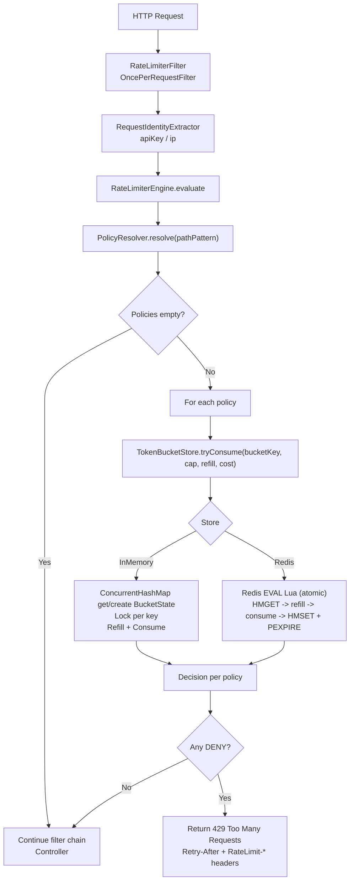

# Rate Limiter — Decisiones de diseño

## Objetivo del problema

Construí un **Rate Limiter** que, para cada request HTTP, decide **ALLOW / DENY** para:

* prevenir abuso y picos,
* proteger recursos finitos (threads, CPU, DB, downstreams),
* ser correcto bajo **concurrencia** y en **escenarios distribuidos**,
* mantener **baja latencia** (está en el camino crítico de cada request),
* ser configurable y testeable.

## Contexto tecnológico elegido

* **Kotlin + Spring Boot MVC** (servlet / thread-per-request).
* Implementé rate limiting como un **componente transversal** al negocio (cross-cutting).

---

## Arquitectura por capas (estructura del repo)

Separé el código para mantener el core simple, testeable y con infraestructura intercambiable:

* **web/**

    * `RateLimiterFilter` (filtro servlet)
    * extracción de identidad: `RequestIdentityExtractor`
    * DTOs de error y headers HTTP
* **application/**

    * `RateLimiterEngine`: orquesta evaluación de policies y combina decisiones
    * `PolicyResolver`: elige qué reglas aplican por path
    * `RequestIdentityContext`: selecciona identidad según estrategia
* **domain/**

    * modelos (`Policy`, `RateLimitDecision`, etc.)
    * `TokenBucketStore` (puerto/interfaz)
    * `Clock` (abstracción de tiempo)
* **infrastructure/**

    * `InMemoryTokenBucketStore` (implementación local, thread-safe)
    * `RedisTokenBucketStore` + `RedisScripts` (implementación distribuida)
    * wiring de beans (`BeansConfig`)

---

## Flujo de una request (high level)

1. Llega request al server (Tomcat/Jetty).
2. `RateLimiterFilter` intercepta temprano.
3. Extraigo identidades (API key / IP).
4. `RateLimiterEngine` resuelve policies aplicables por `pathPattern`.
5. Por cada policy: consumo tokens del bucket correspondiente (InMemory o Redis).
6. Si alguna policy deniega → respondo **429** + headers.
7. Si todas permiten → continúo cadena de filtros → controller.

### Diagrama (Mermaid)

---

## Decisión clave: dónde ubicar el rate limiter

### Elegí `OncePerRequestFilter`

**Por qué:**

* Es el punto más “de borde” en Spring MVC → corto temprano y protejo mejor el **thread pool**.
* Se ejecuta **una sola vez por request** (evito dobles ejecuciones en forwards/includes).
* No acoplo la lógica a controllers (queda más limpio que AOP/anotaciones para este challenge).
* Puedo devolver 429 de forma consistente desde el mismo lugar.

**Alternativas consideradas:**

* `HandlerInterceptor`: válido, pero corre más “adentro” (ya resolvió handler mapping).
* AOP: útil para concerns por método/anotación, pero suele correr tarde y tiene trampas (self-invocation).

---

## Modelo de reglas (Policies)

Una **policy** representa una regla configurable:

* `name`: identifica la regla (también participa en la key del bucket).
* `pathPattern`: matchea rutas (AntPathMatcher).
* `keyStrategy`: define la identidad de la cuota (`API_KEY` o `IP`).
* `capacity`: tokens máximos acumulables (burst permitido).
* `refillTokensPerSecond`: tasa de recarga (promedio).
* `cost`: costo por request (permite “requests más caras”).

Esto me permite aplicar varias reglas a la misma request (por ejemplo, global + endpoint-specific).

---

## Identidad: por qué uso API key (y IP como alternativa)

* `API_KEY` me da fairness por cliente y suele ser más estable que IP.
* IP es útil como fallback o para endpoints públicos, aunque puede ser compartida (NAT/proxy) y cambiar.

Implementación:

* API key: header `X-Api-Key` (si falta, puedo tratarlo como “anonymous” o decidir por policy).
* IP: `X-Forwarded-For` (primer valor) o `remoteAddr`.

---

## Algoritmo elegido: Token Bucket

Elegí **Token Bucket** porque:

* permite bursts controlados (`capacity`) sin romper el promedio (`refill`),
* es estándar en industria,
* es fácil de explicar y testear,
* evita el “edge burst” típico de fixed window.

### Refill “lazy”

No uso un job de recarga. Calculo el refill **cuando llega una request** (en `tryConsume`):

* `delta = now - lastRefill`
* `tokens = min(capacity, tokens + delta * refillRate)`
* luego intento consumir `cost`.

---

## Store intercambiable (puerto)

`TokenBucketStore` define la operación crítica:

* `tryConsume(key, capacity, refillTokensPerSecond, cost) -> Allowed/Deny`

Esto me permite cambiar la implementación sin tocar el core:

* **IN_MEMORY** (dev/tests, simple)
* **REDIS** (correctitud distribuida)

---

## InMemory: por qué `ConcurrentHashMap` + `ReentrantLock`

Hay dos problemas de concurrencia distintos:

1. **Acceso al mapa de buckets**

    * Uso `ConcurrentHashMap` y `computeIfAbsent` para obtener/crear `BucketState` por key sin carreras.
2. **Operación read-modify-write del bucket**

    * Uso un lock **por bucket** (`ReentrantLock`) para que refill + consumo sea atómico por key y no se permitan requests de más.

Elegí lock por key para reducir contención comparado con un lock global.

---

## Redis: cómo funciona y por qué Redis

### Por qué elijo Redis (vs otra NoSQL)

* Latencia muy baja (in-memory) y alto throughput para estado pequeño por request.
* TTL nativo para limpieza automática de buckets.
* Atomicidad simple y robusta con **Lua** (read-modify-write sin races entre pods).

### Atomicidad con Lua

Ejecuto un script con `EVAL` que hace:

* `HMGET` tokens + ts
* calcula refill y aplica cap
* decide allow/deny y descuenta
* `HMSET` tokens + ts
* `PEXPIRE` TTL
* devuelve `{allowed, tokens, retryAfterMs}`

Redis ejecuta el script como una única unidad sin interleaving con otros comandos, por lo que no hay race conditions para una misma key.

### Modelo guardado en Redis

Guardo el mínimo necesario:

* Hash:

    * `tokens` (Double)
    * `ts` (ms)
* TTL por key (limpieza)

`tokens` mantiene el saldo; `ts` permite calcular `delta` para refill; TTL evita crecimiento infinito.

### TTL dinámico

Calculo TTL en función de “tiempo para recargar a full”:

* si `refill <= 0`: TTL fijo grande (ej 1h)
* si `refill > 0`: TTL ≈ `2 * secondsToFull` con mínimo (ej 1 min)

---

## Failure modes: FAIL_OPEN vs FAIL_CLOSED

Si falla el store (Redis caído/timeout), aplico una estrategia configurable:

* **FAIL_OPEN**: permito y marco `degraded=true`
  (más disponibilidad, menos protección)
* **FAIL_CLOSED**: bloqueo y marco `degraded=true`
  (más protección, riesgo de bloquear tráfico legítimo)

---

## Headers HTTP y debug controlado

### Headers principales

* `RateLimit-Limit`
* `RateLimit-Remaining`
* `RateLimit-Reset` (cuando aplica)
* `Retry-After` (solo en 429)

### Debug headers (opcional)

Solo los habilito si el cliente lo pide explícitamente (ej. `Debug: true`) y bajo una condición adicional (ej. `Client` no vacío) para no filtrar internals por defecto.

---

## Tiempo: por qué abstraigo `Clock`

Podría usar `Instant.now()`/`System.currentTimeMillis()`, pero abstraigo `Clock` para:

* tests determinísticos sin sleeps,
* control de escenarios de delta-tiempo,
* evitar flakiness.

En tests uso un `TestClock` que puedo avanzar manualmente.

---
## Concurrencia y ejecución en múltiples instancias (distributed behavior)

### Problema

En un despliegue típico hay **múltiples instancias** del servicio detrás de un load balancer. Si el rate limiter guarda estado **en memoria local**, el límite deja de ser global:

* Objetivo: `100 req/min` por `apiKey`
* Con 10 instancias y limiter in-memory: se puede permitir ~`100 req/min` **por instancia** (≈ `1000 req/min` total), porque cada pod tiene su propio bucket/contador.

### Decisión

Para soportar límites globales en modo distribuido, guardo el estado del bucket en un store compartido (**Redis**) y hago el update de forma **atómica** usando un script **Lua**.

### Por qué hace falta atomicidad

El update del token bucket es una operación **read–modify–write**:

1. leer `tokens` y `ts`
2. calcular refill por `delta`
3. decidir allow/deny
4. persistir nuevo estado

Si hago esos pasos con múltiples comandos desde la aplicación, dos instancias pueden leer el mismo estado en paralelo y permitir de más (“double allow”). Con Lua, Redis ejecuta todo el script como una sola unidad sin interleaving, eliminando esa condición de carrera.

#### Ejemplo (2 instancias, misma apiKey)

Config:

* `capacity=1`, `refill=0`, `cost=1`
* bucketKey: `rl:global:API_KEY:abc` con `tokens=1`

**Sin Lua (GET/SET separados):**

* Pod A lee `tokens=1` → decide ALLOW
* Pod B lee `tokens=1` → decide ALLOW
* Ambos escriben `tokens=0`
  Resultado: se permiten **2** requests con capacidad **1**.

**Con Lua (EVAL atómico):**

* Pod A ejecuta script → ve `tokens=1` → ALLOW → guarda `tokens=0`
* Pod B ejecuta script después → ve `tokens=0` → DENY
  Resultado: se permite **1** request y se rechaza el resto correctamente.

### Comportamiento esperado

* **IN_MEMORY**: correcto en single instance; no garantiza límite global en múltiples instancias.
* **REDIS**: consistente por `bucketKey` a través de todas las instancias (misma key → misma cuota).

---

## Consideraciones de thread pools (MVC)

En Spring MVC cada request consume un thread. Por eso corto temprano con filter para evitar trabajo innecesario y prevenir colas grandes. Si tuviera más tiempo, sumaría un **concurrency limiter** (semaphore/bulkhead) para proteger pools de DB/downstreams cuando la latencia sube.

---

## Estrategia de testing

* Unit tests del core:

    * refill, cap, consume, retryAfter
    * resolver de policies por pathPattern
    * engine combinando múltiples policies
* Tests de concurrencia (InMemory):

    * asegurar que no se “pasan” tokens bajo race
* Integration test con Redis (Testcontainers):

    * validar atomicidad real y comportamiento del store
